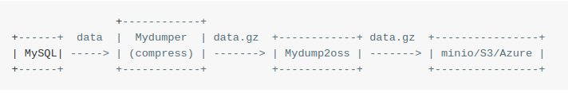

# Mydump2oss [中文](README_CN.md)

Mydump2oss is a tool to upload local files (like mysql-backups) to MiIo, S3, Azure, Google Cloud Storage. You can set the authentication configurations with `cfg` or use --config to specify the authentication configuration file.

## Features

* upload files to multiple Cloud Storage
* upload files with little memory-space occupied

## Prerequisites

* local files like mysql-backups
* MinIo，S3，Azure Cloud Storage Service

## Description 
On linux, use other tools (like Mydumper) to prepare files, then upload files to Cloud Storage. Also, you can use linux crontab to run this work periodically.

## Work flow

<!--                     +------------+                                            
     +------+  data  |  Mydumper  | data.gz  +------------+ data.gz  +----------------+   
     | MySQL| ---- -> | (compress) | ------ -> | Mydump2oss | ------ -> | minio/S3/Azure |   
     +------+        +------------+          +------------+          +----------------+
-->

## Usage
    
    shieber@Kew:files 🐁  Mydump2oss --help
    Mydump2oss, a tool to upload files to MinIo/S3... Cloud Storage

    Usage:
      Mydump2oss [command]

    Available Commands:
      cfg         Set authentication configurations
      cp          Copy local objects to a remote bucket
      help        Help about any command
      ls          List objects of remote bucket(s)
      mb          Make remote bucket(s)
      mr          Synchronize local objects to a remote bucket
      rmb         Remove remote bucket(s)
      rmo         Remove remote object(s)

    Flags:
          --config string   Config file to store Cloud Storage Authentication Info.
      -h, --help            help for Mydump2oss
      -v, --version         version for Mydump2oss

    Use "Mydump2oss [command] --help" for more information about a command.

    shieber@Kew:Mydump2oss 🐁 Mydump2oss cp --help
    Copy local objects to a remote bucket on MinIo/S3 Cloud Storage

    Usage:
      Mydump2oss cp obj(s) ... bucket [flags]

    Aliases:
      cp, copy, upload

    Examples:
      Mydump2oss cp file.sql mysql_backup

    Flags:
      -h, --help   help for cp

    Global Flags:
          --config string   Config file to store Cloud Storage Authentication Info.

## Detaild cmd usages
[cfg](docs/cfg.md)
[cp](docs/cp.md)
[ls](docs/ls.md)
[mb](docs/mb.md)
[mr](docs/mr.md)
[rmb](docs/rmb.md)
[rmo](docs/rmo.md)

## Code statistics

    -------------------------------------------------------------------------------
    Language                     files          blank        comment           code
    -------------------------------------------------------------------------------
    Go                                14             104              26             612
    Markdown                      10             112               0             212
    make                             1              13               3              38
    JSON                             1               0               0               1
    -------------------------------------------------------------------------------
    SUM:                            26            229             29            863
    -------------------------------------------------------------------------------
