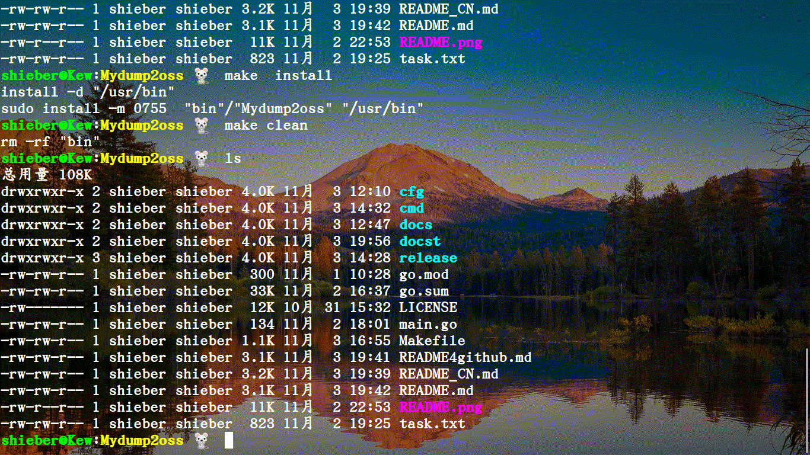

# Mydump2oss [中文](README4github.md)

Mydump2oss is a tool to upload local files (like mysql-backups) to MinIo, S3, Azure, Google Cloud Storage. You can set the authentication configurations with `cfg` or use --config to specify the authentication configuration file.

Mydump2oss's prerequisites:

* local files like mysql-backups
* MinIo，S3，Azure Cloud Storage Service

Mydump2oss provides:

- [x] upload files concurrently
- [x] customizable Cloud Storage
- [ ] upload files with small memory-space occupied 

On linux, use other tools (like Mydumper) to prepare files, then upload files to Cloud Storage. Also, you can use crontab job to run this work periodically.

Data flow:

<!--                     +------------+                                            
     +------+  data  |  Mydumper  | data.gz  +------------+ data.gz  +----------------+   
     | MySQL| ---- -> | (compress) | ------ -> | Mydump2oss | ------ -> | minio/S3/Azure |   
     +------+        +------------+          +------------+          +----------------+
-->

## Installation
Using Mydump2oss is easy.

##### get the repo

    three ways to get src repo.
    1.git clone git@github.com/QMHTMY/Mydump2oss.git
    2.go get -u github.com/QMHTMY/Mydump2oss
    3.gh repo clone QMHTMY/Mydump2oss

##### make or build

    cd Mydump2oss/ 
    make # or go build
    make install # make uninstall

##### Install from .deb

Download the latest release deb-package from [releases](https://github.com/QMHTMY/Mydump2oss/releases) 

    sudo dpkg -i Mydump2oss_x.x_linux_amd64.deb

## Usage
    

    shieber@Kew:files 🐁  Mydump2oss --help
    Mydump2oss, a tool to upload files to MinIo/S3... Cloud Storage

    Usage:
      Mydump2oss [command]

    Available Commands:
      cfg         Set authentication configurations
      cp          Copy local objects to a remote bucket
      help        Help about any command
      ls          List objects of remote bucket(s)
      mb          Make remote bucket(s)
      mr          Synchronize local objects to a remote bucket
      rmb         Remove remote bucket(s)
      rmo         Remove remote object(s)

    Flags:
          --config string   Config file to store Cloud Storage Authentication Info.
      -h, --help            help for Mydump2oss
      -v, --version         version for Mydump2oss

    Use "Mydump2oss [command] --help" for more information about a command.

## Detailed usage
[cfg](docs/cfg.md)
[cp](docs/cp.md)
[ls](docs/ls.md)
[mb](docs/mb.md)
[mr](docs/mr.md)
[rmb](docs/rmb.md)
[rmo](docs/rmo.md)
