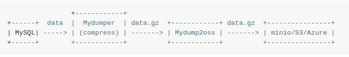

# Mydump2oss

Mydump2oss 是一个将MySQL数据库备份上传到MinIo，S3，Azure等云存储的工具。具体云服务认证信息可用`cfg`指令设置，或用--config指定保存有云服务认证信息的文件。

Mydump2oss支持：

* 上传备份文件到云对象存储
* 支持本地盘空间较小的情况下一次性上传(非分批)

使用前Mydump2oss需要：

* mydumper等工具导出的数据库备份
* MinIo，S3，Azure等云存储服务

Linux下，使用Mydumper备份mysql等数据库并压缩，接着Mydump2oss工具将压缩后的备份文件上传到MinIo，S3，Azure等的云对象存储中。可使用crontab定制job，定时备份数据库到云存储。

<!--                     +------------+                                            
     +------+  data  |  Mydumper  | data.gz  +------------+ data.gz  +----------------+   
     | MySQL| ---- -> | (compress) | ------ -> | Mydump2oss | ------ -> | minio/S3/Azure |   
     +------+        +------------+          +------------+          +----------------+
-->

## 安装

可从源码或deb包安装Mydump2oss。

##### 获取源码
    三种方式获取 
    1.git clone git@gitee.com/QMHTMY/mydump2oss.git
    2.git clone https://gitee.com/QMHTMY/mydump2oss.git
    3.下载zip包再解压

##### make 或 build

    cd mydump2oss
    make # go build
    make install # make uninstall

##### 直接从deb包安装

从[releases](https://gitee.com/QMHTMY/mydump2oss/releases)下载最新版deb包，然后安装 

    sudo dpkg -i Mydump2oss_x.x_linux_amd64.deb

## 使用
    
    shieber@Kew:files 🐁  Mydump2oss --help
    Mydump2oss, a tool to upload files to MinIo/S3... Cloud Storage

    Usage:
      Mydump2oss [command]

    Available Commands:

    shieber@Kew:files 🐁  Mydump2oss --help
    Mydump2oss, a tool to upload files to MinIo/S3... Cloud Storage

    Usage:
      Mydump2oss [command]

    Available Commands:
      cfg         Set authentication configurations
      cp          Copy local objects to a remote bucket
      help        Help about any command
      ls          List objects of remote bucket(s)
      mb          Make remote bucket(s)
      mr          Synchronize local objects to a remote bucket
      rmb         Remove remote bucket(s)
      rmo         Remove remote object(s)

    Flags:
          --config string   Config file to store Cloud Storage Authentication Info.
      -h, --help            help for Mydump2oss
      -v, --version         version for Mydump2oss

    Use "Mydump2oss [command] --help" for more information about a command.

    shieber@Kew:Mydump2oss 🐁 Mydump2oss cp --help
    Copy local objects to a remote bucket on MinIo/S3 Cloud Storage

    Usage:
      Mydump2oss cp obj(s) ... bucket [flags]

    Aliases:
      cp, copy, upload

    Examples:
      Mydump2oss cp file.sql mysql_backup

    Flags:
      -h, --help   help for cp

    Global Flags:
          --config string   Config file to store Cloud Storage Authentication Info.

## 各指令详细用法
[cfg](docs/cfg.md) 
[cp](docs/cp.md) 
[ls](docs/ls.md) 
[mb](docs/mb.md) 
[mr](docs/mr.md) 
[rmb](docs/rmb.md) 
[rmo](docs/rmo.md) 
